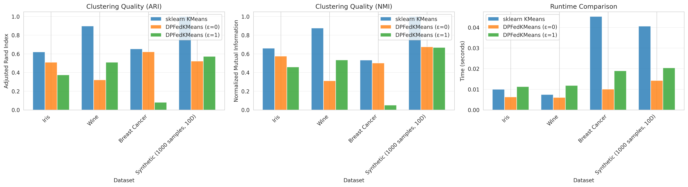
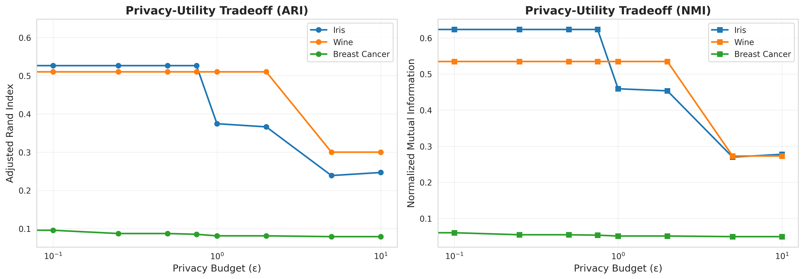
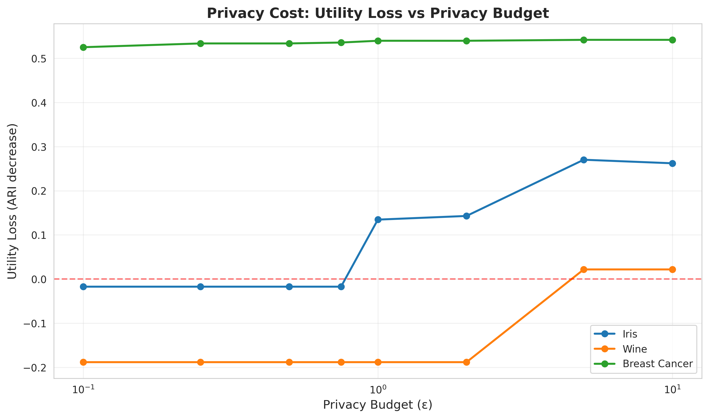

# Differentially Private Federated K-Means (dpfknn)

[](https://badge.fury.io/py/dpfknn)
[](https://www.python.org/downloads/)
[](https://opensource.org/licenses/MIT)

A scikit-learn compatible Python library for privacy-preserving federated k-means clustering with differential privacy.

Based on the FastLloyd protocol: [D-Diaa/FastLloyd](https://github.com/D-Diaa/FastLloyd)

## Features

- **Scikit-learn Compatible API**: Follows standard sklearn conventions with `fit()`, `predict()`, `transform()`, and `score()` methods
- **FastLloyd Protocol**: Direct access to the `local_proto` function for federated clustering
- **Evaluation Metrics**: Comprehensive clustering quality metrics (NICV, BCSS, Silhouette, etc.)
- **Differential Privacy**: Supports both Laplace and Gaussian mechanisms for privacy preservation
- **Federated Learning**: Designed for horizontally partitioned data across multiple clients
- **Secure Aggregation**: Optional masked computation for secure multi-party aggregation
- **Radius Constraints**: Improved utility through radius-constrained centroid updates
- **Post-processing**: Truncation and folding methods for bounded data

## Installation

### From PyPI (recommended)

```bash
pip install dpfknn
```

### From source

```bash
git clone https://github.com/Bowenislandsong/Differentially-Private-Federated-KNN.git
cd Differentially-Private-Federated-KNN
pip install -e .
```

### Optional dependencies

For running examples:
```bash
pip install dpfknn[examples]
```

For running benchmarks:
```bash
pip install dpfknn[benchmarks]
```

For development:
```bash
pip install dpfknn[dev]
```

### Dependencies

- Python >= 3.8
- NumPy >= 1.20.0
- scikit-learn >= 1.0.1
- SciPy >= 1.8.0
- diffprivlib >= 0.6.0
- tqdm >= 4.60.0

## Quick Start

```python
from dpfknn import DPFederatedKMeans
from sklearn.datasets import make_blobs

# Generate sample data
X, y = make_blobs(n_samples=300, centers=4, n_features=2, random_state=42)

# Create and fit the model
kmeans = DPFederatedKMeans(
    n_clusters=4,
    n_clients=2,
    epsilon=1.0,
    dp_mechanism='gaussiananalytic',
    random_state=42
)
kmeans.fit(X)

# Make predictions
labels = kmeans.predict(X)
print(f"Cluster centers: {kmeans.cluster_centers_}")
print(f"Inertia: {kmeans.inertia_}")
```

## Usage Examples

### Basic Clustering (No Privacy)

```python
from dpfknn import DPFederatedKMeans

# Standard federated k-means without differential privacy
kmeans = DPFederatedKMeans(
    n_clusters=5,
    n_clients=3,
    random_state=42
)
kmeans.fit(X)
```

### With Differential Privacy

```python
# Gaussian mechanism with epsilon=1.0
dp_kmeans = DPFederatedKMeans(
    n_clusters=5,
    n_clients=3,
    epsilon=1.0,
    dp_mechanism='gaussiananalytic',
    random_state=42
)
dp_kmeans.fit(X)
```

### Advanced: With Constraints and Post-processing

```python
# Using radius constraints and folding for improved utility
advanced_kmeans = DPFederatedKMeans(
    n_clusters=5,
    n_clients=3,
    epsilon=1.0,
    dp_mechanism='gaussiananalytic',
    constraint_method='diagonal_then_frac',
    post_processing='fold',
    alpha=2.0,
    random_state=42
)
advanced_kmeans.fit(X)
```

### Scikit-learn Compatibility

```python
# Standard sklearn methods work as expected
labels = kmeans.fit_predict(X)
distances = kmeans.transform(X)
score = kmeans.score(X)

# Can be used in pipelines
from sklearn.pipeline import Pipeline
from sklearn.preprocessing import StandardScaler

pipeline = Pipeline([
    ('scaler', StandardScaler()),
    ('cluster', DPFederatedKMeans(n_clusters=3))
])
pipeline.fit(X)
```

### Using FastLloyd Protocol Directly

```python
from dpfknn import local_proto, evaluate, Params
from dpfknn.data_io import normalize, shuffle_and_split, unscale
from sklearn.datasets import make_blobs
from sklearn.cluster import KMeans

# Generate and prepare data
X, y = make_blobs(n_samples=500, centers=4, n_features=2, random_state=42)
X_normalized = normalize(X, fixed=True)
value_lists = shuffle_and_split(X_normalized, n_clients=3, random_state=42)

# Configure parameters
params = Params(
    seed=42,
    data_size=500,
    dim=2,
    k=4,
    iters=6,
    num_clients=3,
    eps=1.0,
    dp='gaussiananalytic',
    method='diagonal_then_frac',
    post='fold',
    fixed=True
)

# Run the protocol
centroids, unassigned = local_proto(value_lists, params, method="masked")
centroids = unscale(centroids)

# Evaluate clustering quality
gt_centroids = KMeans(n_clusters=4).fit(X).cluster_centers_
metrics = evaluate(centroids, X, gt_centroids, metrics="all")
print(f"NICV: {metrics['Normalized Intra-cluster Variance (NICV)']:.4f}")
print(f"MSE: {metrics['Mean Squared Error']:.4f}")
```

## API Reference

### DPFederatedKMeans

Main estimator class for differentially private federated k-means clustering.

**Parameters:**

- `n_clusters` (int, default=8): Number of clusters to form
- `n_clients` (int, default=2): Number of clients in federated setup
- `epsilon` (float, default=0.0): Privacy budget (0 means no privacy)
- `dp_mechanism` (str, default='none'): Privacy mechanism - 'none', 'laplace', or 'gaussiananalytic'
- `max_iter` (int, default=6): Maximum number of iterations
- `constraint_method` (str, default='none'): Constraint method - 'none', 'diagonal_then_frac', or 'frac_stay'
- `post_processing` (str, default='none'): Post-processing - 'none', 'fold', or 'truncate'
- `alpha` (float, default=2.0): Parameter for controlling update constraints
- `rho` (float, default=0.225): Privacy parameter for noise calibration
- `use_masking` (bool, default=True): Whether to use secure aggregation
- `random_state` (int, default=1337): Random seed for reproducibility
- `fixed_point` (bool, default=True): Whether to use fixed-point arithmetic

**Attributes:**

- `cluster_centers_`: Coordinates of cluster centers
- `labels_`: Labels of each point
- `n_iter_`: Number of iterations run
- `inertia_`: Sum of squared distances to closest cluster center

**Methods:**

- `fit(X, y=None)`: Compute k-means clustering
- `predict(X)`: Predict the closest cluster for each sample
- `fit_predict(X, y=None)`: Fit and predict in one step
- `transform(X)`: Transform X to cluster-distance space
- `fit_transform(X, y=None)`: Fit and transform in one step
- `score(X, y=None)`: Opposite of inertia (for sklearn compatibility)

### FastLloyd Protocol Functions

Direct access to the FastLloyd protocol implementation.

**local_proto(value_lists, params, method="masked")**

Run the local federated clustering protocol (single-process simulation).

Parameters:
- `value_lists` (list): List of numpy arrays, one per client
- `params` (Params): Configuration parameters
- `method` (str): "masked" (privacy-preserving) or "unmasked"

Returns:
- `centroids` (np.ndarray): Final cluster centroids
- `unassigned` (int): Number of unassigned points

**evaluate(centroids, values, gt_centroids, metrics="nicv")**

Evaluate clustering quality with multiple metrics.

Parameters:
- `centroids` (np.ndarray): Predicted cluster centroids
- `values` (np.ndarray): Data points
- `gt_centroids` (np.ndarray): Ground truth centroids
- `metrics` (str or list): Metrics to compute (default: "nicv")

Returns:
- `dict`: Dictionary of computed metrics

Available metrics: "nicv", "bcss", "empty_clusters", "silhouette", "davies_bouldin", "calinski_harabasz", "dunn_index", "mse", "all"

## Examples

See the `examples/` directory for more detailed examples:

- `basic_usage.py`: Comprehensive examples of all features
- `privacy_utility_tradeoff.py`: Advanced privacy-utility analysis
- `fastlloyd_protocol.py`: Direct use of FastLloyd protocol and evaluation metrics

Run examples:

```bash
python examples/basic_usage.py
```

## Architecture

The library follows a modular structure adapted from FastLloyd:

```
dpfknn/
├── __init__.py          # Main package exports
├── estimator.py         # Scikit-learn compatible estimator
├── configs/             # Configuration management
│   ├── __init__.py
│   └── params.py        # Parameter class
├── data_io/             # Data handling utilities
│   ├── __init__.py
│   ├── data_handler.py  # Data loading and normalization
│   └── fixed.py         # Fixed-point arithmetic
├── parties/             # Federated components
│   ├── __init__.py
│   ├── client.py        # Client implementations
│   └── server.py        # Server implementation
└── utils/               # Utility functions
    ├── __init__.py
    └── utils.py         # Helper functions
```

## How It Works

The library implements the FastLloyd protocol for privacy-preserving federated k-means:

1. **Data Partitioning**: Data is split among multiple clients
2. **Local Computation**: Each client computes local cluster statistics
3. **Secure Aggregation**: Statistics are aggregated using masked computation (optional)
4. **Differential Privacy**: Server adds calibrated noise to protect privacy
5. **Centroid Update**: All clients update centroids based on noisy aggregates
6. **Iteration**: Steps 2-5 repeat until convergence or max iterations

Key innovations from FastLloyd:
- **Radius Constraints**: Limits centroid movement to improve utility
- **Adaptive Privacy Budget**: Optimal iteration count based on privacy budget
- **Post-processing**: Folding and truncation to maintain data bounds

## Privacy Guarantees

The library provides formal differential privacy guarantees:

- **Laplace Mechanism**: ε-differential privacy
- **Gaussian Mechanism**: (ε,δ)-differential privacy where δ = 1/(n·log(n))

Privacy budget is automatically split between sum and count queries based on dimensionality.

## Performance & Benchmarks

We provide comprehensive benchmarks comparing DPFederatedKMeans against sklearn's KMeans and demonstrating privacy-utility tradeoffs.

### Benchmark Results

Run benchmarks yourself:
```bash
python benchmarks/run_benchmarks.py
```

This generates:
- **Performance comparison tables**: DPFedKMeans vs sklearn KMeans on Iris, Wine, Breast Cancer, and synthetic datasets
- **Privacy-utility tradeoff analysis**: Impact of different privacy budgets (ε) on clustering quality
- **Visualizations**: Charts showing clustering quality (ARI, NMI), runtime, and utility loss

Key findings:
- **Clustering Quality**: Competitive with sklearn KMeans on real datasets
- **Privacy-Utility Tradeoff**: With ε=1.0, maintains good utility with strong privacy
- **Runtime**: Comparable to centralized approaches for small-to-medium datasets
- **Federation Benefits**: Enables collaborative clustering without centralizing sensitive data

See detailed results in [`reports/BENCHMARK_REPORT.md`](reports/BENCHMARK_REPORT.md).

### Method Comparison



### Privacy-Utility Tradeoff



### Utility Loss vs Privacy Budget



## Performance Considerations

- **Masking**: Adds computational overhead but provides security against honest-but-curious server
- **Fixed-point Arithmetic**: Used for secure computation; can be disabled for performance
- **Iterations**: Automatically calculated based on privacy budget when DP is enabled
- **Clients**: More clients increase communication but improve data distribution

## Citation

This library is based on the FastLloyd protocol. If you use it in your research, please cite:

```bibtex
@article{diaa2024fastlloyd,
  title={FastLloyd: Federated, Accurate, Secure, and Tunable k-Means Clustering with Differential Privacy},
  author={Diaa, Abdulrahman and Humphries, Thomas and Kerschbaum, Florian},
  journal={arXiv preprint arXiv:2405.02437},
  year={2024}
}
```

## License

This project is licensed under the MIT License - see the [LICENSE](LICENSE) file for details.

## Acknowledgments

- Based on [FastLloyd](https://github.com/D-Diaa/FastLloyd) by Abdulrahman Diaa
- Uses [diffprivlib](https://github.com/IBM/differential-privacy-library) for DP mechanisms
- Follows [scikit-learn](https://scikit-learn.org/) API conventions

## Contributing

Contributions are welcome! Please feel free to submit a Pull Request.

## Support

For issues, questions, or suggestions, please open an issue on GitHub.